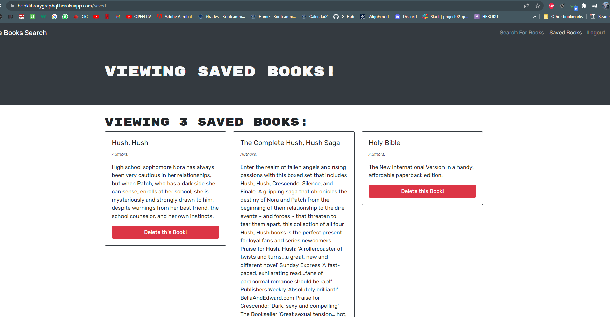
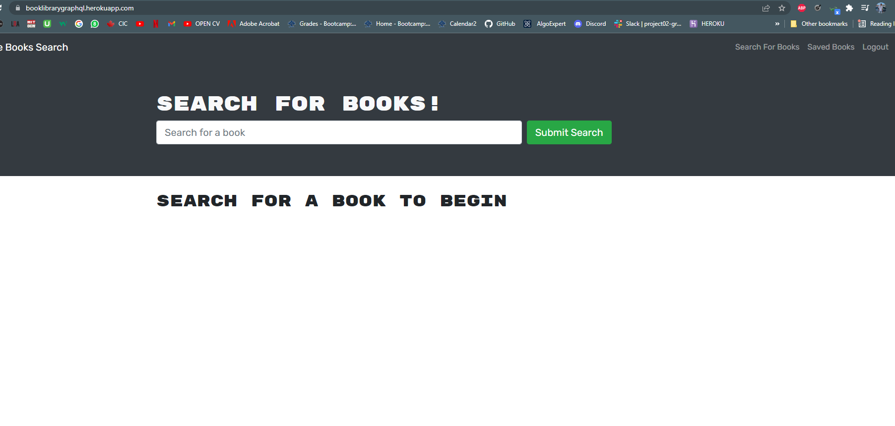

<h1 align='center'>Book Library Using GraphQl</h1>
    
    <h2 id="description">Description</h2>
    
In this project, we created a full stack MERN application where we had REACT for front end and used MongoDb for the backend Database and used GraphQl for routing. The user is presented with a search bar where the input would display the books accordingly. However, the user will not be able to save those books until logged in. This app provides the ability to do so by clicking on the login/signup button. Once the user logs in, his saved books will be displayed in the savedbooks in the navigation menu. Also, the user can delete a book that would delete the book from the database and also re-render the component reflecting the change right away.

Link : <a href="https://booklibrarygraphql.herokuapp.com/">https://booklibrarygraphql.herokuapp.com/</a>
    

    <h2>Table of Contents</h2>
    <ul>
        <li><a href="#description">Description</a></li>
        <li><a href="#install">Installation</a></li>
        <li><a href="#usage">Usage</a></li>
        <li><a href="#license">License</a></li>
        <li><a href="#contri">Contributing</a></li>
        <li><a href="#test">Tests</a></li>
        <li><a href="#question">Questions</a></li>
    </ul>
    

    <h2 id="install">Installation</h2>
    
apollo, react, graphql

    

    <h2 id="usage">Usage</h2>
    
UofT Bootcamp

    

    <h2 id="license">License</h2>
    
    
MIT

    

    <h2 id="contri">Contributing</h2>
    
Karan Sodhi

    

    <h2 id="test">Tests</h2>
    
unit

    

    <h2 id="question">Questions</h2>
    
Incase of questions, Find me on: 

    
 :<a href='mailto: karanpreetsodhi1997@gmail.com'>Email</a>

    
 :<a href='https://github.com/kkkaran'>Github</a>

